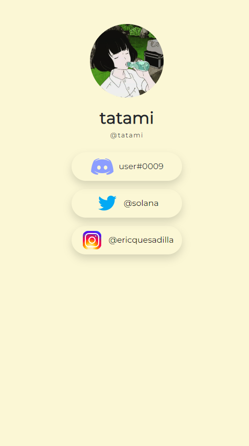

# tat.cx

https://tatpreview.herokuapp.com

Example profile: https://tatpreview.herokuapp.com/tatami

## Technologies Used
- MongoDB
- React.js
- Express.js
- Node.js
- BCrypt
- JWT

## Project Summary

Tat.cx is a link showcase profile similar to that of linktr.ee. It gives you the capability of sharing your social media links on a singular
responsive webpage, which can be beneficial especially to content creators and those trying to grow their platform in general.
This project was created after my FIRST day learning React and its basics. This included some basics which were essentially props and UseState.

## Preview

## Credits

[linktr.ee](https://linktr.ee) for inspiration
* Design icons were provided by [icons8](https://icons8.com/)